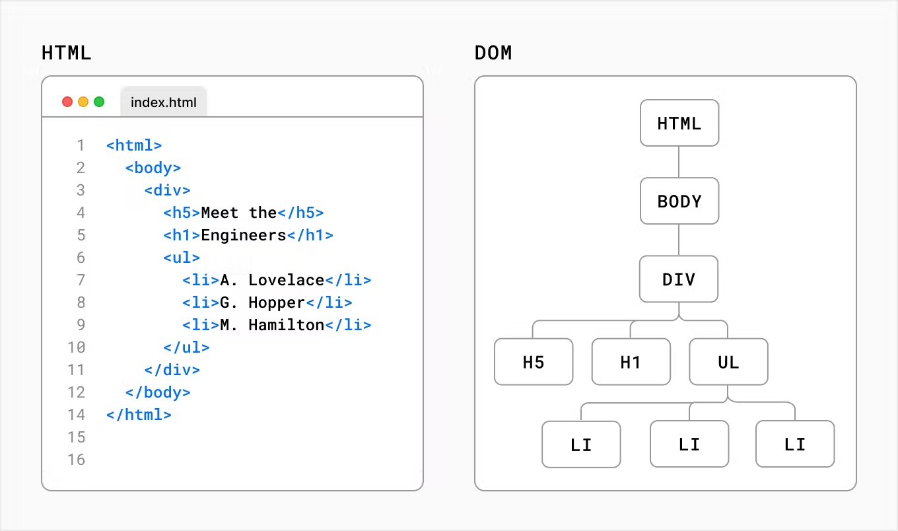

# マークダウンの書き方
> こんな感じ
"aiueo"

">" で引用

"#" で見出し

" * or number " でリスト

* \*
* \#
* \>
* '***' '---'
* \<link>
<https://google.com>

---

# chapter1 DOM とは何か



サーバーにアクセスすると、http が返る。ブラウザが受け取った場合、右のようにHTMLをパースする。
DOM とは　html のオブジェクト表現であり、interactive な user interface を作成する橋になる。developer は DOM を操作することでhtml を書き換え、ユーザー(ブラウザ?)はDOM の変更を受け取ることでcode から受けた変更を反映する。

***

# chapter2 DOMをいじる
DOM化されたHTMLはjavascript からIDを参照することで編集できる

```index.html
<div id="app"></div>
```
こんな感じで名付けたhtml のオブジェクトがあるなら

```index.html
<html>
  <body>
    <div id="app"></div>
 
    <script type="text/javascript">
      const app = document.getElementById('app');
    </script>
  </body>
</html>
```

こんな風に、要素がとってこれる。
今回はscript ベタ書きだが、load されるタイミングを操作対象のDOMが作成される前にしなければ、
```
<script src=index.js>
```

こんな感じで呼び出せるよ

h1の要素を追加しようと思ったら
```index.html
<script type="text/javascript>
	const app = document.getElementById('app');
	const header = document.createElement('h1');
	const text = 'Develop. Preview Ship. 🚀';
	const headerContext = document.createTextNode(text);
	header.appendChild(headerContext);
	app.appendChild(header);
</script>
```
このように書くことができる。このコードは命令型プログラミングのいい例だ。関数型プログラミングでいこう！それがreact

# 6
props とは、compnoent に渡す引数のこと
funcion(props) と書く場合と、 function ({props}) と渡すのは、オブジェクトかどうかの違い
要は、多分、props: string みたいな感じで受け取ると 任意の名前の文字列を props として受け取れる。
一方で、 ({props}) と書いた場合、このまま単純に宣言すれば、渡ってきたオブジェクトの中にある、props というkey 名に保存されたvalue が渡される。値渡しなのか、ポインタ渡しなのかは知らない。